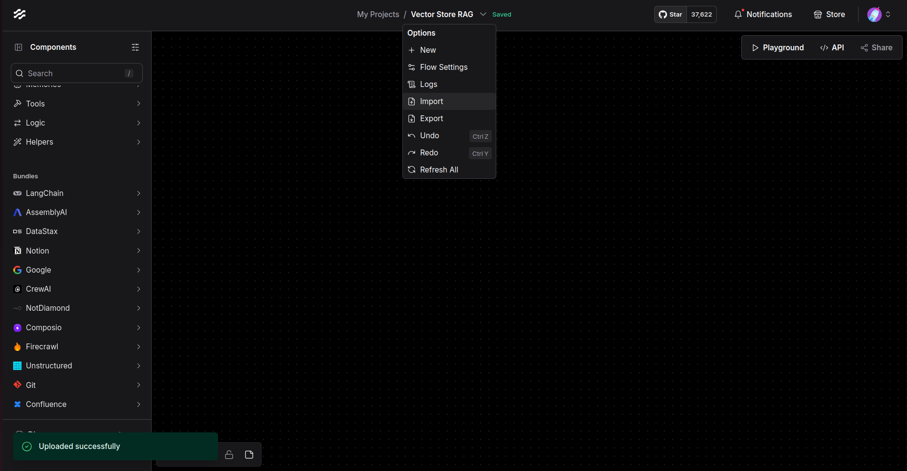

<p align="center" style="font-size: 12px;">
    Langflow là một nền tảng low code mã nguồn mở ứng dụng trong việc xây dựng các sản phẩm ít mã nguồn cho RAG và các ứng dụng multi-agent AI. Sản phẩm này được code dựa trên Python và có thể tích hợp bất kỳ một model, API hay cơ sở dữ liệu nào khi cần thiết.
</p>

<p align="center" style="font-size: 12px;">
    <a href="https://docs.langflow.org" style="text-decoration: underline;">Docs</a> -
    <a href="https://astra.datastax.com/signup?type=langflow" style="text-decoration: underline;">Free Cloud Service</a> -
    <a href="https://docs.langflow.org/get-started-installation" style="text-decoration: underline;">Self Managed</a>

</p>

## ✨ Các tính năng nổi bật của LangFlow

1. **Dựa trên Python** và không phụ thuộc vào mô hình, API, nguồn dữ liệu hoặc cơ sở dữ liệu.
2. **Giao diện IDE trực quan** cho việc xây dựng và thử nghiệm các workflow bằng cách kéo và thả.
3. **Playground** để thử nghiệm và lặp lại các workflow ngay lập tức với điều khiển từng bước.
4. **Quản lý nhiều tác nhân** và điều phối cuộc trò chuyện, cũng như truy xuất dữ liệu.
5. **Dịch vụ đám mây miễn phí** giúp bắt đầu trong vài phút mà không cần thiết lập.
6. **Xuất bản dưới dạng API** hoặc xuất ra ứng dụng Python.
7. **Quan sát** với tích hợp LangSmith, LangFuse hoặc LangWatch.
8. **Bảo mật và khả năng mở rộng cấp doanh nghiệp** với dịch vụ đám mây Langflow miễn phí của DataStax.
9. **Tùy chỉnh workflow** hoặc tạo flow hoàn toàn chỉ bằng Python.
10. **Tích hợp hệ sinh thái** như các thành phần tái sử dụng cho bất kỳ mô hình, API hoặc cơ sở dữ liệu nào.

## **✨ Hướng dẫn sử dụng LangFlow cơ bản**
[](https://www.youtube.com/watch?v=kinngWhaUKM)

## **✨ Hướng dẫn cài đặt LangFlow platform**

Để bắt đầu với LangFlow, bạn cần cài đặt và dựng lại nền tảng trên chính thiết bị của bạn.
1. Clone LangFlow repository:
   ```bash
    git clone https://github.com/langflow-ai/langflow.git
   ```
2. Di chuyển đến thư mục docker_example:
   ```bash
    cd langflow/docker_example
    ```

3. Chạy file Docker Compose:
   ```bash
    docker-compose up -d
   ```

4. Truy cập vào LangFlow http://localhost:7860/ (nếu bạn dưng trên chính máy chủ của mình) hoặc http://your-ip-address:7860/ (nếu bạn dựng trên server của mình). Tiếp theo, bạn tạo mới một Flow cho AI với lựa chọn `Import`, import file Vector Store RAG.json và bắt đầu phát triển ứng dụng.

<p align="center">
    
</p>

- Sau khi đã import xong chúng ta có thể sử dụng API key của mô hình bằng cách nhấn vào API ở trên góc phải màn hình.

---

#### **📬 Liên Hệ và Góp Ý**

Nếu bạn có bất kỳ câu hỏi nào hoặc muốn đóng góp cho dự án, bạn có thể liên hệ qua email hoặc GitHub Issues:
- ✉️ **Email**: 
    - Phạm Đình Tiến: phamdt203@gmail.com
    - Đặng Hoàng Phương: hoangphuong270703@gmail.com
    - Nguyễn Tiến Kiên: tienkiennropro@gmail.com
- 🐙 **GitHub Issues**: [Issue]("https://github.com/HIT-OS/SOS-CONNECT-BE/issues/new?assignees=&labels=&projects=&template=bug_report.md&title=")


