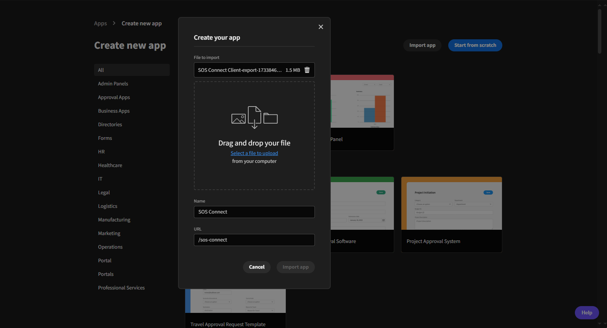
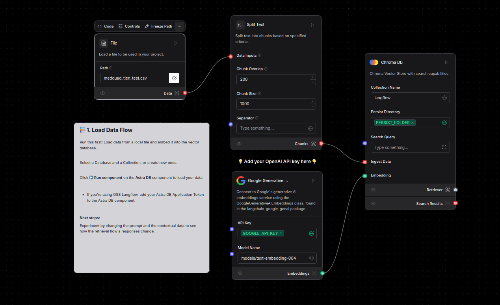
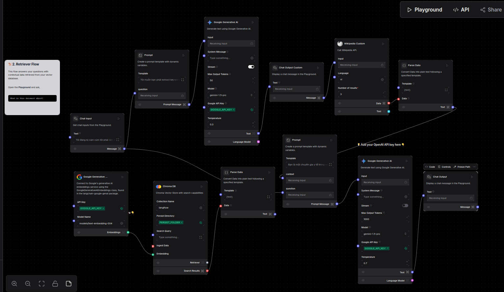

<h1>SOS Connect</h1>

<p align="center">
    
</p>

[](https://github.com/HIT-OS/SOS-CONNECT-BE/blob/main/LICENSE)
[](https://github.com/HIT-OS/SOS-CONNECT-BE/issues)
[](https://github.com/HIT-OS/SOS-CONNECT-BE/pulls)
[](https://github.com/HIT-OS/SOS-CONNECT-BE/graphs/commit-activity)
[](https://github.com/HIT-OS/SOS-CONNECT-BE/graphs/contributors)

🎉 Chào mừng bạn đến với kho mã nguồn backend của **SOS Connect**, một ứng dụng được thiết kế để cung cấp hỗ trợ khẩn cấp theo thời gian thực và các dịch vụ liên lạc. Backend này xử lý quản lý người dùng, báo cáo sự cố, thông báo theo thời gian thực, và lưu trữ dữ liệu.

---

## Mục lục
- [💾 Giới thiệu](#-giới-thiệu)
- [✨ Tính năng](#-tính-năng)
- [💻 Công nghệ sử dụng](#-công-nghệ-sử-dụng)
- [🛠️ Cài đặt](#️-cài-đặt)
- [🤝 Đóng góp cho dự án](#-đóng-góp-cho-dự-án)
- [🚀 Liên hệ](#-liên-hệ)
- [📝 License](#-license)

---

## Giới thiệu

Ứng dụng SOS Connect giúp kết nối giữa nhân dân với tình nguyện viên, thực hiện kêu gọi cứu trợ khi gặp trở ngại khó khăn, thống kê về thiệt hại và hỗ trợ cứu trợ sau thiên tai hoặc dịch bệnh. Mục tiêu của dự án là phát triển một hệ thống dựa trên các nền tảng LCDP mã nguồn mở để kết nối các các tình nguyện viên với các tổ chức chính quyền địa phường, các tổ chức muốn tham gia hỗ trợ tái thiết sau thiên tai và dịch bệnh, phục hồi cuộc sống, kinh tế, xã hội của đất nước.

Dự án được thực hiện trong cuộc thi Phần Mềm Nguồn Mở Olympic Tin học Sinh viên Việt Nam 2024. Được cấp phép nguồn mở theo giấy phép [GPL V3](https://www.gnu.org/licenses/gpl-3.0.html) bởi đội HaUI.HIT-OS13.

Để biết thêm chi tiết về cuộc thi, mọi người có thể xem đề tài của cuộc thi tại [đây](docs/exam_topic_open_source_2024.pdf), thông tin về cuộc thi mã nguồn mở của Olympic Tin Học Sinh Viên năm 2024 tại [đây](https://vfossa.vn/tin-tuc/cong-bo-de-thi-noi-dung-phan-mem-nguon-mo-olympic-tin-hoc-sinh-vien-viet-nam-2024-727.html).

Để hiểu rõ hơn về hệ thống của dự án, có thể đọc tài liệu đặc tả của dự án tại [đây](docs/SRS_SOS_Connect.pdf)

Link slide thuyết trình dự thi tại [đây](https://www.canva.com/design/DAGWnmJZWjo/QKufW1WAumndxgjB55kEaw/edit?ui=eyJEIjp7IlAiOnsiQiI6ZmFsc2V9fX0)

---

## ✨ Tính năng

💾 **Quản lý người dùng:**

- Đăng ký, xác thực và kiểm soát truy cập dựa trên vai trò.

✨ **Heatmap cho sự cố báo cáo**:

- Tính năng heatmap sẽ giúp hiển thị các sự cố khẩn cấp trên bản đồ, với các vùng có sự cố nhiều hơn được làm nổi bật bằng màu sắc.

📍 **Báo cáo sự cố:**

- API để báo cáo các trường hợp khẩn cấp cùng dữ liệu vị trí.

🔔 **Thông báo theo thời gian thực:**

- Gửi thông báo đến người phản hồi gần nhất theo thời gian thực.

💾 **Lưu trữ dữ liệu:**

- Lưu trữ an toàn dữ liệu người dùng và thông tin sự cố.

📊 **Bảng điều khiển Admin:**

- Quản lý người dùng, sự cố và cài đặt ứng dụng.

---

## 💻 Công nghệ sử dụng

- **Grafana**: Công cụ giám sát và trực quan hóa dữ liệu với bảng điều khiển động từ nhiều nguồn dữ liệu.
- **LangFlow**: Công cụ Low Code mã nguồn mở trực quan hóa giúp thiết kế luồng công việc và kết nối các thành phần của LangChain.
- **FastAPI**: Framework Python nhanh chóng và hiệu quả, hỗ trợ WebSocket và sinh tài liệu API tự động.
- **TypeScript**: Ngôn ngữ phát triển trên JavaScript với kiểm tra kiểu tĩnh giúp tăng tính chính xác và bảo trì.
- **LangChain**: Thư viện Python hỗ trợ xây dựng ứng dụng ngôn ngữ tự nhiên phức tạp.
- **ChromaDB**: Cơ sở dữ liệu vector để lưu trữ và truy vấn embeddings từ mô hình học sâu.
- **Redis**: Hệ thống lưu trữ dữ liệu trong bộ nhớ cho quản lý phiên và cache.
- **Budibase**: Nền tảng low-code phát triển ứng dụng web tích hợp cơ sở dữ liệu và giao diện trực quan.
- **FlutterFlow**: Nền tảng low-code phát triển ứng dụng di động với giao diện đẹp mắt.
- **Google AI Studio**: Công cụ phát triển ứng dụng AI của Google hỗ trợ xây dựng các ứng dụng thông minh.
- **Docker**: Nền tảng container hóa phần mềm cho phép chạy ứng dụng mọi nơi.
- **Docker-Compose**: Công cụ giúp quản lý các ứng dụng Docker đa container dễ dàng.
- **Wikipedia API**: API cung cấp truy vấn các thông tin của câu hỏi của user dựa trên nguồn dữ liệu của Wikipedia.
- **Github Action**: Nền tảng miễn phí được thiết kế và xây dựng bởi Github. Nền tảng này giúp tự động hóa được quá trình CI/CD.

---

## 🛠️ Cài đặt

1. Yêu cầu 📋

Để cài đặt và chạy được dự án, trước tiên bạn cần phải cài đặt các công cụ bên dưới. Hãy thực hiện theo các hướng dẫn cài đặt sau, lưu ý chọn hệ điều hành phù hợp với máy tính:

- [Docker](https://docs.docker.com/get-docker/)
- [Docker Compose](https://docs.docker.com/compose/install/)

2. Clone repo máy tính của bạn:

```bash
git clone https://github.com/HIT-OS/SOS-CONNECT-BE.git
```

3. Cài đặt Budibase platform:

- Cấu hình cài đặt mặc định cho Budibase platform tại file: `app/.env`

- Chạy câu lệnh:

```bash
docker-compose -f app/docker-compose.yml up -d --build
```

Chạy lệnh trên prompt hoặc terminal sẽ khởi động cụm Budibase, việc cài đặt có thể mất một thời gian để tải xuống các tài nguyên cần thiết.

- Khi ứng dụng sẵn sàng, bạn có thể truy cập [http://localhost:10000](http://localhost:10000), tạo mới một ứng dụng với lựa chọn `Import app`, thêm file import ([link tải](http://)) và bắt đầu phát triển ứng dụng.

<p align="center">
    
</p>

4. Cài đặt LangFlow platform:

- Xem chi tiết hướng dẫn và giới thiệu tại [README](AI/README.md).

- Giới thiệu về Flow của dự án:
    1.  Data Flow
    <p align="center">
        
    </p>

    2.  Retriever Flow
    <p align="center">
        
    </p>    

---

## 🤝 Đóng góp cho dự án

<a href="https://github.com/HIT-OS/SOS-CONNECT-BE/issues/new?assignees=&labels=&projects=&template=bug_report.md&title=">Bug Report ⚠️
</a>

<a href="https://github.com/HIT-OS/SOS-CONNECT-BE/issues/new?assignees=&labels=&projects=&template=feature_request.md&title=">Request Feature 👩‍💻</a>

Mọi đóng góp của các bạn đều được trân trọng, đừng ngần ngại gửi pull request cho dự án.

## 🚀 Liên hệ

- Phạm Đình Tiến: phamdt203@gmail.com
- Đặng Hoàng Phương: hoangphuong270703@gmail.com
- Nguyễn Tiến Kiên: tienkiennropro@gmail.com

## 💬 Cộng đồng

Nếu bạn có bật cứ câu hỏi nào hoặc muốn nói chuyện và đóng góp với các nguwofi dùng Budibase khác, bạn có thể join vào cộng đồng của dự án [Github discussions](https://github.com/HIT-OS/SOS-CONNECT/discussions).
## ❤️ Người đóng góp

[](https://github.com/HIT-OS/SOS-CONNECT-BE/graphs/contributors)

## 📝 License

Dự án này được cấp phép theo các điều khoản của giấy phép [GPL V3](https://www.gnu.org/licenses/gpl-3.0.html).
